# 플랜B

안녕하세요! 플랜B팀의 프로젝트 과정을 담았습니다.

<table>
  <tr>
    <td align="center">
      <strong>강지완</strong><br><br>
      <br>
      <a href="https://github.com/Maroco0109">
        
      </a>
    </td>
    <td align="center">
      <strong>김성욱</strong><br><br>
      <br>
      <a href="https://github.com/souluk319">
        
      </a>
    </td>
    <td align="center">
      <strong>김소희</strong><br><br>
      <br>
      <a href="https://github.com/sosodoit">
        
      </a>
    </td>
    <td align="center">
      <strong>박진형</strong><br><br>
      <br>
      <a href="https://github.com/vispi94">
        
      </a>
    </td>
    <td align="center">
      <strong>이상민</strong><br><br>
      <br>
      <a href="https://github.com/ChocolateStrawberryYumYum">
        
      </a>
    </td>
  </tr>
</table>

## 📂 필술 산출물

| 테이블 | 데이터(폴더) | ipynb |
| ----- | ----- | ----- |
| 통합데이터 | [통합데이터](#) | [전처리](#) |
| 여행마스터 | [여행마스터](#) | [전처리](#) |
| 숙박소비내역 | [숙박소비내역](#) | [전처리](#) |
| 방문지정보 | [방문지정보](#) | [전처리](#) |
| 활동내역 | [활동내역](#) | [전처리](#) |
| 활동소비내역 | [활동소비내역](#) | [전처리](#) |

## 📂 프로젝트 구조

```
  SKN19-mini-1Team/
  ├── data/
  │ ├── tag_code/
  │ │ ├── training/
  │ │ └── validation/
  │ ├── training/
  │ │ ├── TL_csv/
  │ │ ├── final/
  │ │ └── preprocessing/
  │ └── validation/
  │   └── VL_csv/
  ├── assets/
  │ ├── img/
  ├── ppt/
  │ ├── 발표자료.pptx
  │ └── 슬라이드\*.JPG
  ├──  preprocessing/
  │ ├── merge_datasets.py
  │ ├── preprocessing.py
  │ ├── data/
  │ ├── img/
  │ └── notebook/
  ├── README.md
  └── requirements.txt
```

## 🔧 기술 스택

| 분류 | 사용 도구 |
| ----- | ----- |
| 언어 및 환경 |  |
| 데이터 전처리 |   |
| 시각화 |   |
| 협업 |     |

---
---

<br/>

## One Trip, Two Fates 👎👍


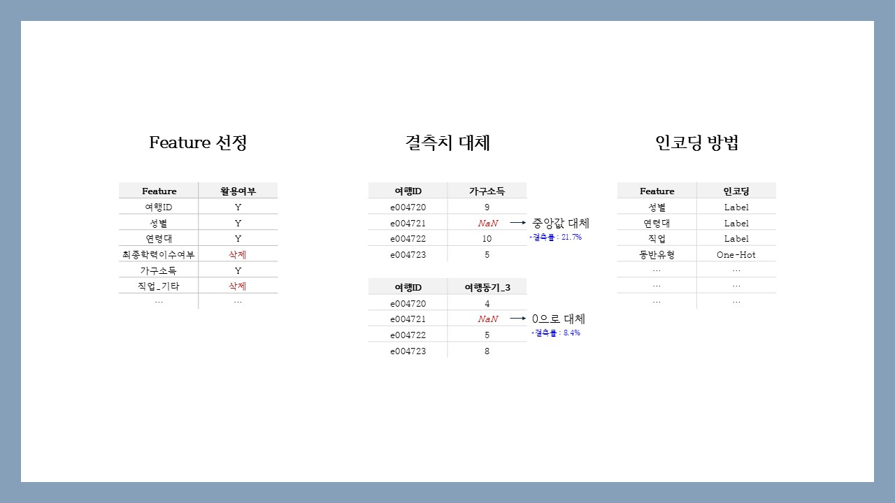
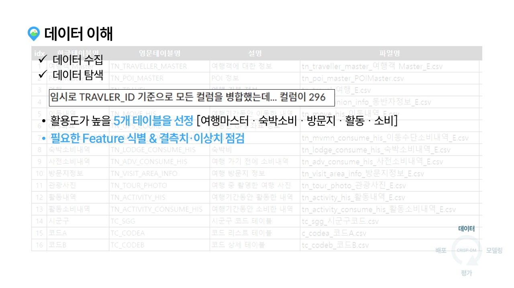
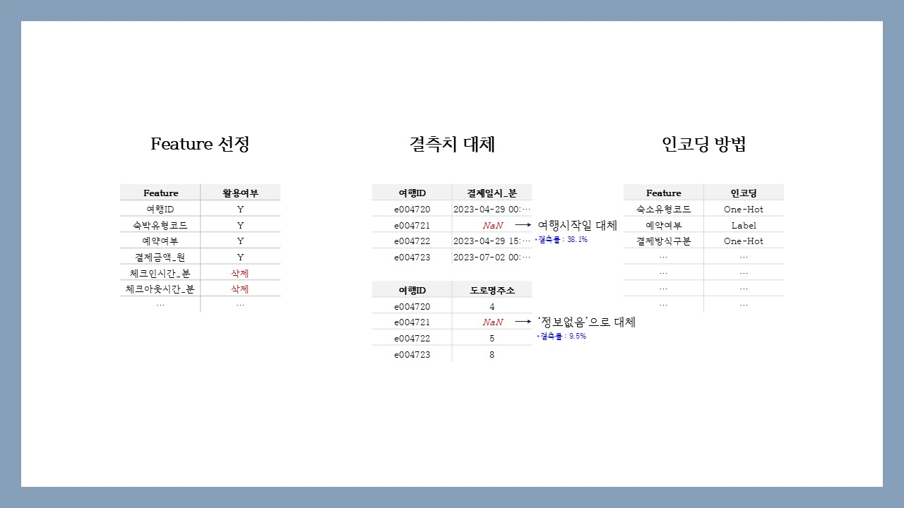
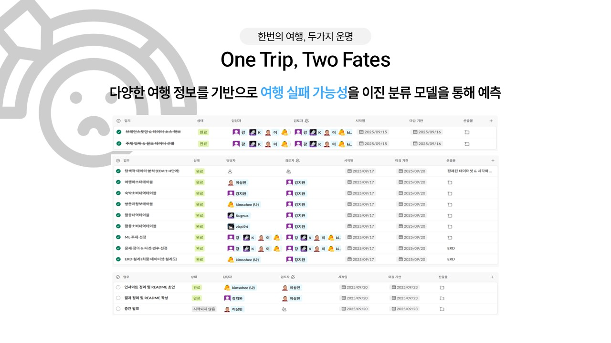

## 🔎 데이터 이해 (EDA)

### ✈️ 여행마스터테이블

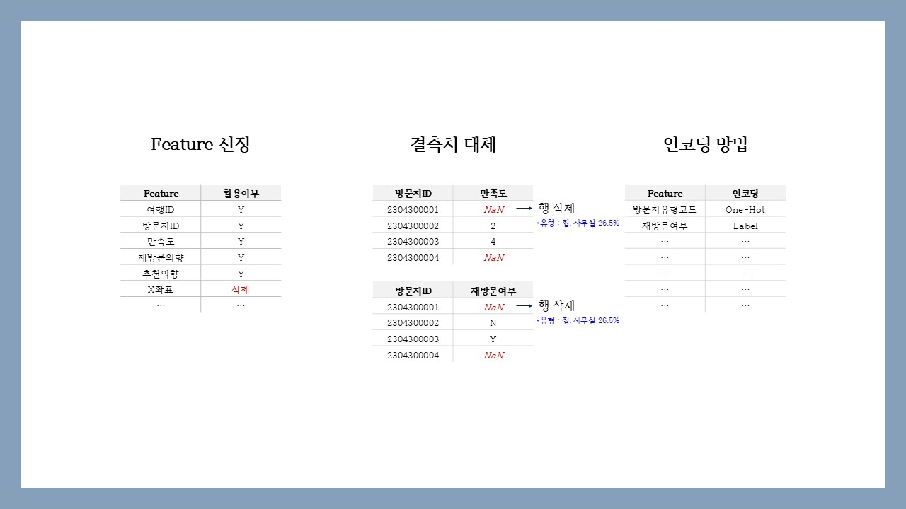
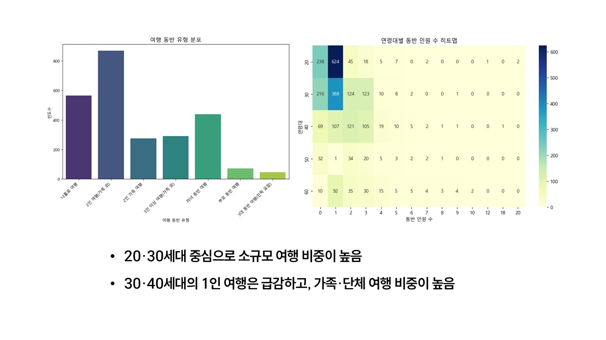

### ✈️ 숙박소비내역테이블

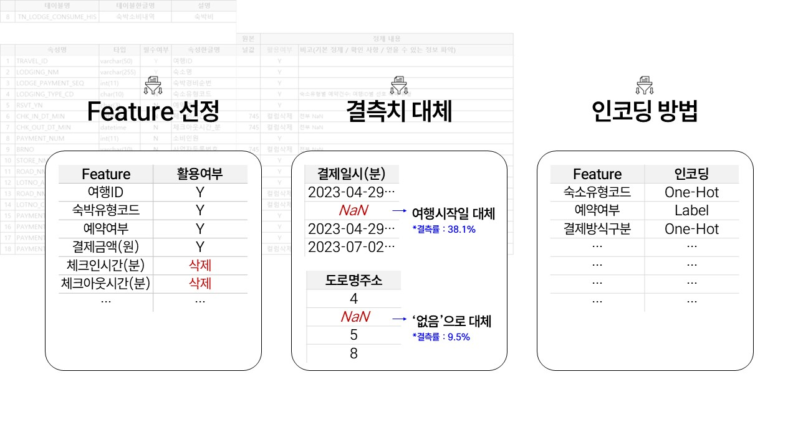
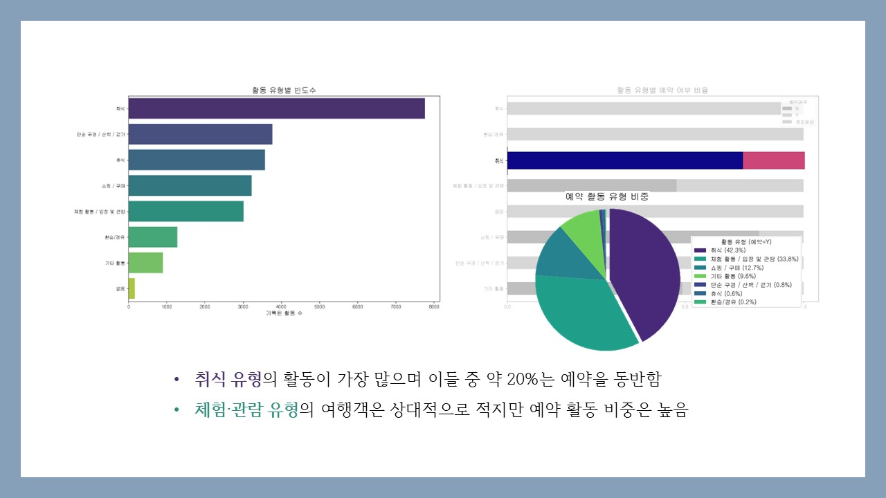

### ✈️ 방문지정보테이블

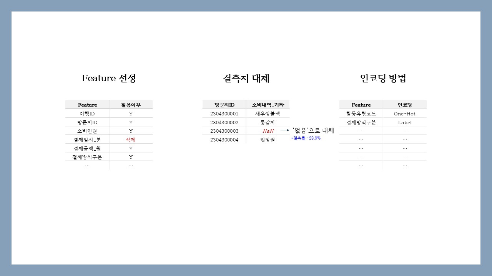
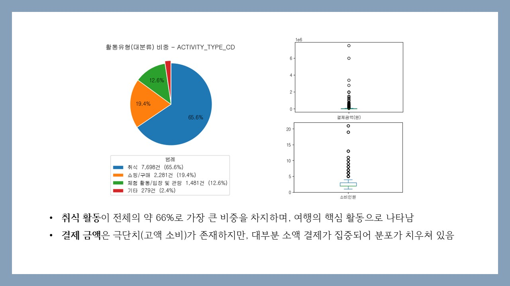

### ✈️ 활동내역테이블

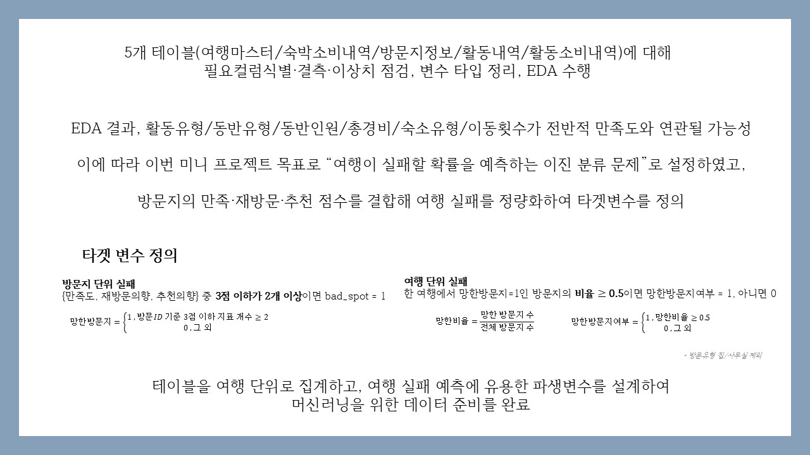
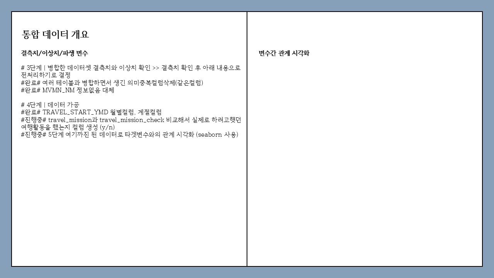

### ✈️ 활동소비내역테이블

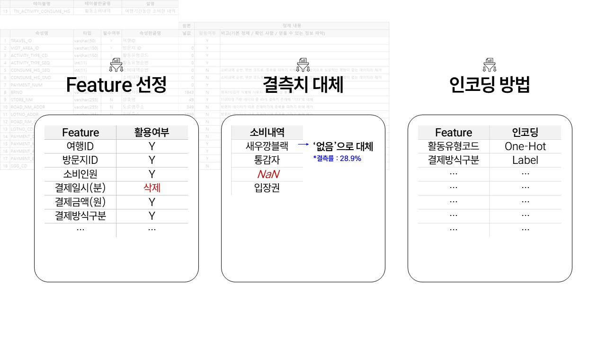
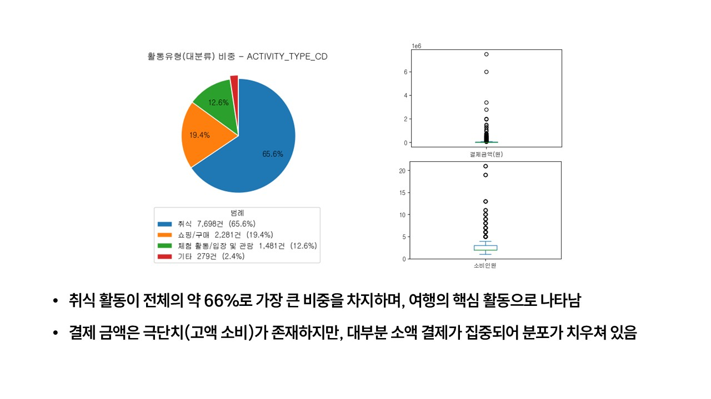

## 💡 인사이트 요약 
- 여행객의 데모그라피에 따라 여행 규모(연령·동반인원·기간·예상등)가 뚜렷하다.
- 일반 숙소 비중이 크지만 이색 숙소도 분포해 "숙박 자체가 목적이 아닌 체험형 수요가 보인다.
- 여행객 특성(동반유형·이동횟수·총경비등)이 방문지 선호와 여행 만족도에 어떤 영향을 주는지 확인할 분석 가치가 있다.
- 활동 유형 조합과 지출·예약 패턴을 분석하여 여행테마·소비성향을 분류함으로써, 
- 출발 전 재미로 눌러보는 
"예측 확인 게임(Like 오늘의 운세는?)"에 반영해 "여행이 망할 확률"을 가볍게 보여주며 간단한 주의 포인트를 함께 제시해주는데 활용해보고자 한다.

## 📖 통합 데이터 개요 · EDA 

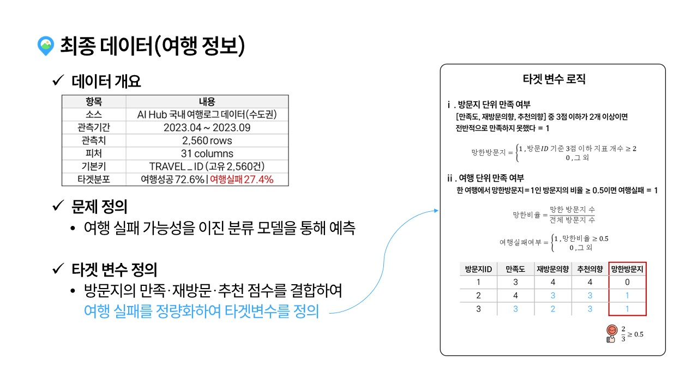
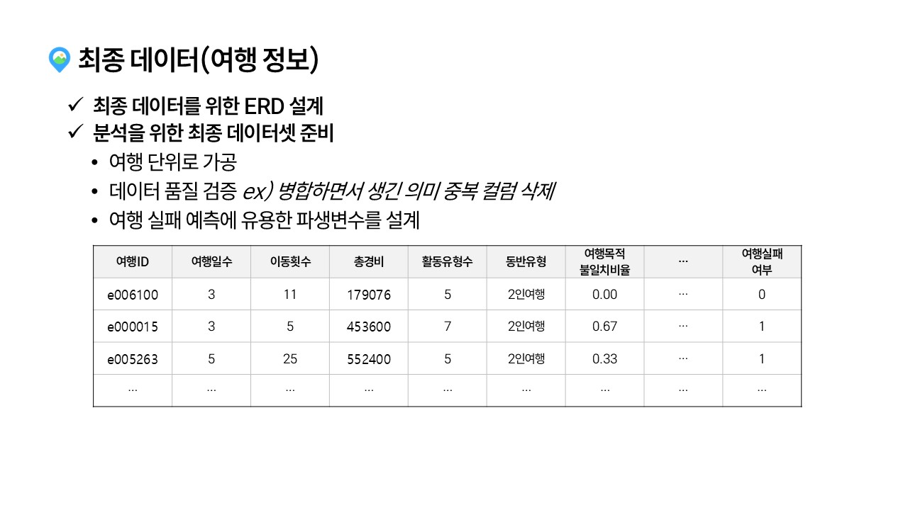
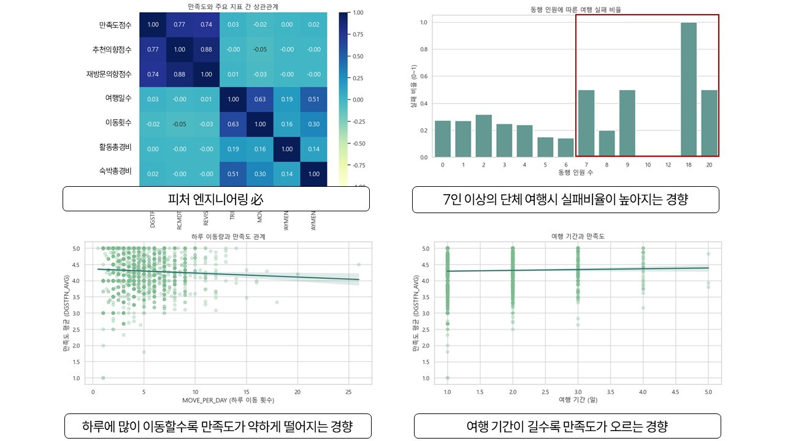

## 💪 NEXT ACTION

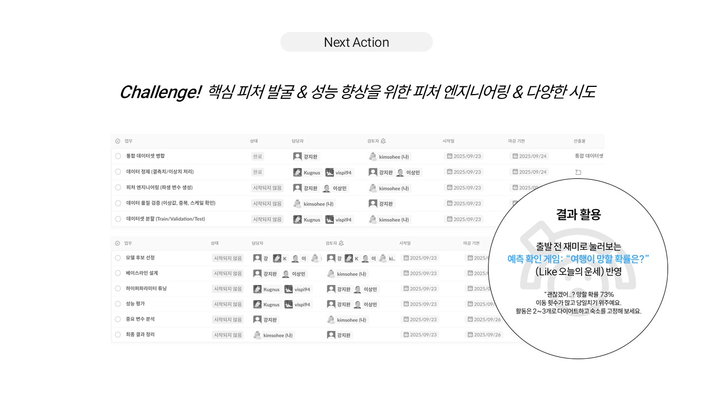

---
---

<br/>

### 📑 프로젝트 히스토리

<details>
<summary>브랜딩도 결과의 일부! 포스터·팀 캐릭터로 메시지 명확화</summary>

- 만든이의 한마디 `by 김성욱`

---

- 포스터가 저희의 프로젝트 메세지의 전달력을 높이는 '키'가 되었다고 생각합니다. 덕분에 팀 정체성이 강화되었습니다. `by 플랜B`

</details>

<details>
<summary>슬랙으로 아이디어는 자유롭게, 진행상황은 즉시 파악</summary>

- 처음 사용해보는 프로그램임에도 모든 팀원들이 적극적으로 활용하여서 뿌듯했습니다. 단순히 git 알람이 온다는 기능만 보고 시작하였는데 프로젝트 개요, 추척기 등을 사용하여 프로젝트 진행 상황을 기록하고 시각화하기 매우 편리했습니다. `by 강지완`

---

- 깃 연동이 되어서 커밋/PR 활동이 자동 알림되어 실시간으로 업무와 그 흐름을 즉각적으로 파악 할 수 있었습니다. `by 플랜B`
</details>

<details>
<summary>브랜치 전략으로 협업 안정화</summary>

- features/작업명-이름 → develop → main
- 개인 브랜치에서 작업하고 통합은 develop에서 검증 후 main에 반영하는 체계로 운용했습니다. `by 플랜B`

</details>

### 💬 한줄회고

<table style="width:100%">
  <tr>
    <th style="min-width: 100px;">이름</th>
    <th>회고 내용</th>
  </tr>
  <tr>
    <td>강지완</td>
    <td>이번 EDA 과정을 진행하면서 협업이 무엇인지에 대해 다시 생각하게 되었습니다. 각자 맡은 일을 하는 분업은 일의 효율이 좋을 수 있지만, 공통된 문제에 대해 다같이 생각해보는 협업은 다양한 시각에서의 접근을 가능하게 해주었습니다. 단순한 문제 해결을 위한 과정보다 각자의 생각을 듣고 말하며 문제에 대한 이해도를 높일 수 있는 기회가 되었습니다.</td>
  </tr>
  <tr>
    <td>김성욱</td>
    <td>회고 내용.</td>
  </tr>
  <tr>
    <td>김소희</td>
    <td>회고 내용.</td>
  </tr>
  <tr>
    <td>박진형</td>
    <td>회고 내용.</td>
  </tr>
  <tr>
    <td>이상민</td>
    <td>회고 내용.</td>
  </tr>
</table>