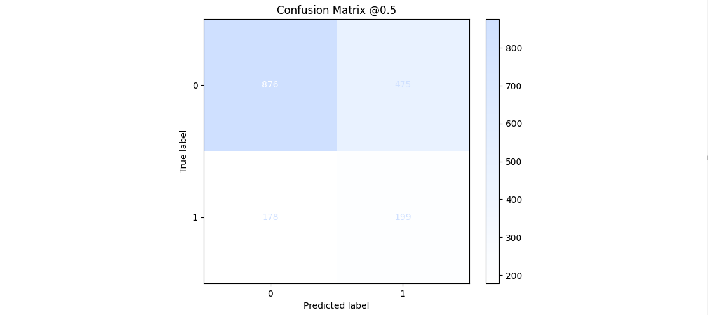
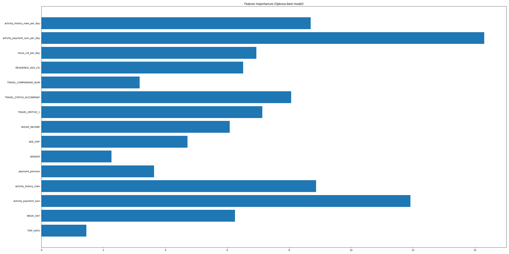
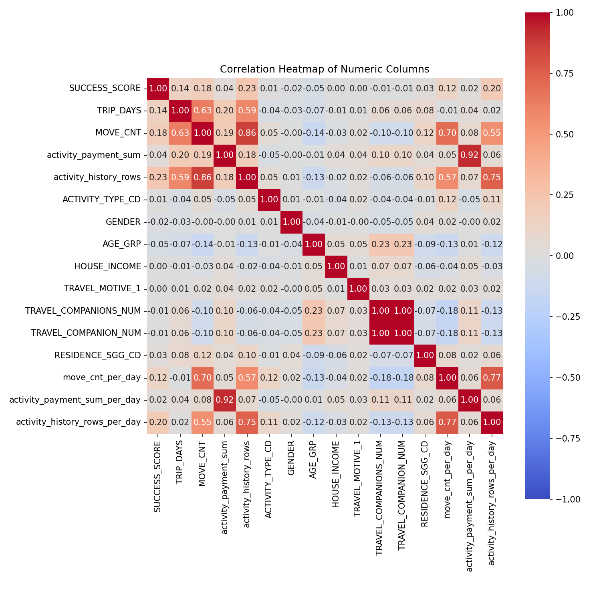
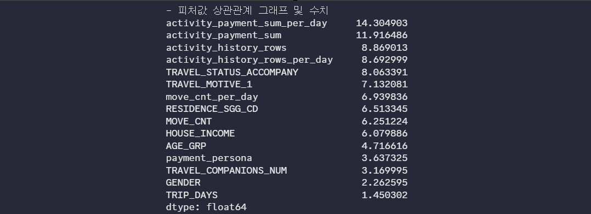
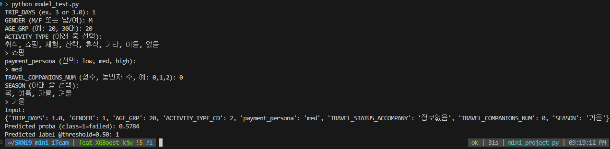
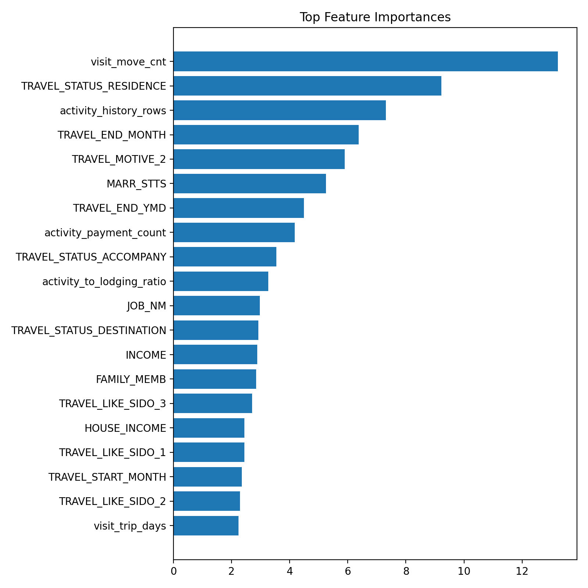
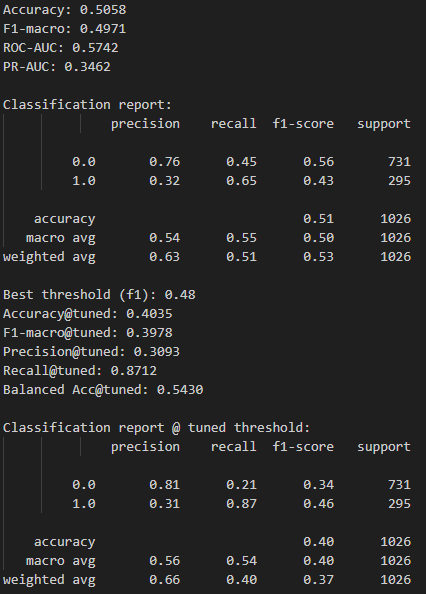
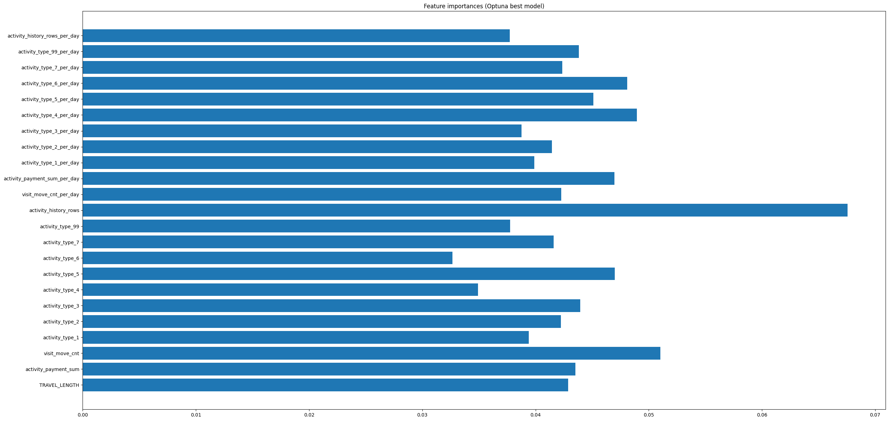
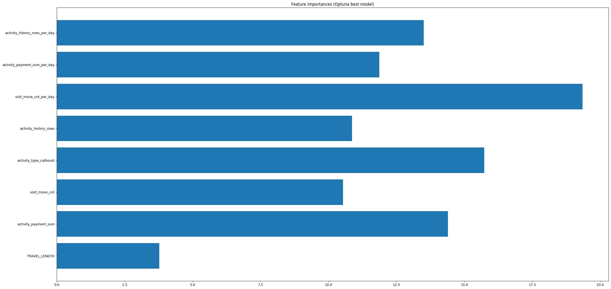

# 플랜B

안녕하세요! 플랜B팀의 프로젝트 과정을 담았습니다.

<table>
  <tr>
    <td align="center">
      <strong>강지완</strong><br><br>
      <br>
      <a href="https://github.com/Maroco0109">
        
      </a>
    </td>
    <td align="center">
      <strong>김성욱</strong><br><br>
      <br>
      <a href="https://github.com/souluk319">
        
      </a>
    </td>
    <td align="center">
      <strong>김소희</strong><br><br>
      <br>
      <a href="https://github.com/sosodoit">
        
      </a>
    </td>
    <td align="center">
      <strong>박진형</strong><br><br>
      <br>
      <a href="https://github.com/vispi94">
        
      </a>
    </td>
    <td align="center">
      <strong>이상민</strong><br><br>
      <br>
      <a href="https://github.com/ChocolateStrawberryYumYum">
        
      </a>
    </td>
  </tr>
</table>

<br/>

# 📂 프로젝트 구조

```

  SKN19-mini-1Team/
  ├── data/
  │ ├── tag_code/
  │ │ ├── training/
  │ │ └── validation/
  │ ├── training/
  │ │ ├── TL_csv/
  │ │ ├── final/
  │ │ └── preprocessing/
  │ └── validation/
  │   └── final/
  ├── ML/
  │ ├── outputs/
  │ ├──00_ML_EDA.ipynb
  │ ├──01_CatBoost.ipynb
  │ ├──01_clust_cat.ipynb
  │ ├──01_Clustering.ipynb
  │ ├──01_SVM.ipynb
  │ ├──01_XGBoost.ipynb
  │ ├──cols.py
  │ ├──columns.py
  │ ├──oof_probabilities_compare.csv
  │ ├──TN_traveler_catboost.csv
  │ ├──TN_traveler.csv
  │ ├──TP_traveler_catboost.csv
  │ ├──TP_traveler.csv
  ├── assets/
  │ └──img/
  │ │ └── *.png
  ├──  preprocessing/
  │ ├── merge_datasets.py
  │ ├── preprocessing.py
  │ ├── data/
  │ ├── img/
  │ └── notebook/
  ├── READNE_ML.md
  └── requirements.txt

```
<br/>

# 🔧 기술 스택

| 분류              | 사용 도구 |
|-------------------|-----------|
| 언어 및 환경      |  |
| 머신러닝 / 모델링 |    |
| 시각화            |   |
| 협업              |     |


---

<br/>

# One Trip, Two Fates 👎👍

# 💡 리마인드


- 사용자의 입력값을 토대로 여행의 성공/실패 확률을 예측하는 것이 목표.
- 이진 분류 모델을 선택하게 되었고 EDA 과정을 거쳐 필요한 데이터를 정제, ML에 사용할 수 있도록 변환.
- 도출한 인사이트를 이용해 어떤 방향으로 프로젝트를 진행할지 계획.

<br/>

# ❓프로젝트 착수 전 고려사항

- 타겟 변수는 설정하였지만, 다른 피처값들과의 상관 관계가 전혀 없다는 점.
- 여러 피처값은 해당 여행객이 어떤 여행을 했는가를 보여주는 일종의 페르소나 역할이었음.
- 객관적인 지표가 없는 상황에서 여행의 성공/실패를 예측하는 것은 상당히 어렵다고 생각이 들었고 실제로도 문제가 따름.

<br/>

# ☀️ 최종 모델 & 성능

- **CatBoost 알고리즘을 통해 학습한 모델 사용**







- Confusion Matrix가 나타내듯, 유의미한 True Positive값 확인.
- 활동 관련한 피처에서 높은 점수를 보여주고 있으며, 이후로는 동반자 현황, 하루 이동량, 등 존재.
- 모델을 활용하여 사용자의 여행 기간, 성별, 연령대, 선호 활동 유형, 소비 페르소나, 동반자 수, 선호 계절을 입력받고
학습된 데이터를 기반으로 확률을 계산하는 모델을 설계

<br/>

# 📕 모델 선정 & 성능 향상 과정

<br/>

- ### 타겟 레이블의 변화 :
  - 만족도, 재방문 의향, 추천 의향을 2가지 방법으로 검토하여 분류하는 방식.<br/>
    → 위와 같은 컬럼들은 **여행 성공/실패를 나누기에는 큰 상관 관계가 없다는 결과**를 EDA 과정에서 확인.

  - 타겟 변수에 추가적인 지표를 넣어 점수화를 하는 것을 목표로 변경.<br/>
<br/>

- ### 피처 선정의 변화 :
  - 이동 거리와 여행 길이는 만족도에 대해 약한 상관관계를 보였음.<br/>
    → 하지만, **학습을 시킬만큼 뚜렷하지는 않음**을 파악.

  - 변화된 레이블에 맞춰 저희는 활동에 중심을 맞추기로 결정.
<br/>

- ### 모델 선정 :
  - **CatBoost 모델을 선택**
  - TRAVEL_ID를 기반으로 각 여행의 페르소나를 갖고 있는 데이터 → **범주형 변수가 많음.**
  - 처음에 중요하다고 생각했던 여행 목적과 여행 후 달성한 목적 피처값은 약 22개의 매핑된 코드에 대해 설명이 있는 방식.<br/>
    이 코드는, 한개의 TRAVEL_ID가 적게는 1개, 많게는 4개 이상도 갖고 있었기에 이들을 모두 인코딩 하게 된다면,<br/> 
    여행 목적 컬럼에서 22개, 여행 후 달성한 목적 컬럼에서 22개, 44개의 컬럼이 만들어지게 되는걸 확인.

<br/>

## 1️⃣ 1차 실행

<table>
  <tr>
    <td align="center">
      <br>
    </td>
    <td align="center">
      <br>
    </td>
  </tr>
</table>

- Catboost 적용 및 학습<br/>
불균형 처리 모드 변경 : IMBALANCE_MODE = auto_balanced<br/>
`THRESHOLD_TUNING`(`'none'|'f1'|'f05'|'precision_at'`) -> f1, `TARGET_PRECISION`(기본 0.80)<br/>
다음 전처리 단계 제거: `TRAVEL_ID`, `RESIDENCE_SGG_CD`, `TRAVEL_LIKE_SIDO_1/2/3`, `TRAVEL_STATUS_RESIDENCE`<br/>
관련 인코딩 및 전역 인코딩 루틴 전체, 모든 스케일링(`*_SCALED`) 생성 루틴 전체.

<br/>

## 2️⃣ 2차 실행

<br/>

## 📊 XGBoost 성능 요약 (threshold = 0.50)

**전처리/정의**
- 특징 스케일링: *Standard Scaling*
- 타깃 라벨: “점수 **3점 미만** → class 1 (fail)”
- 사용 모델: **XGBoost**

| Split |   Acc | ROC-AUC | PR-AUC | Precision(1) | Recall(1) |  F1(1) |   TN |  FP |  FN |  TP |
|------:|------:|--------:|-------:|-------------:|----------:|-------:|-----:|----:|----:|----:|
| Train | 0.7805|  0.9033 | 0.2689 |        0.15  |     0.90  |  0.26  | 2991 | 868 |  17 | 155 |
| Test  | 0.7483|  0.6460 | 0.0734 |        0.08  |     0.44  |  0.14  | 1258 | 391 |  44 |  35 |

<details>
  <summary>원문 평가 리포트 펼치기</summary>

  <pre>
Decision threshold: 0.50
=====Train (BestModel)======================================================================
Acc : 0.7805
Confusion Matrix
[[2991  868]
 [  17  155]]
              precision    recall  f1-score   support

           0       0.99      0.78      0.87      3859
           1       0.15      0.90      0.26       172

    accuracy                           0.78      4031
   macro avg       0.57      0.84      0.57      4031
weighted avg       0.96      0.78      0.85      4031

ROC-AUC : 0.9033
PR-AUC  : 0.2689
=====Test (BestModel)======================================================================
Acc : 0.7483
Confusion Matrix
[[1258  391]
 [  44   35]]
              precision    recall  f1-score   support

           0       0.97      0.76      0.85      1649
           1       0.08      0.44      0.14        79

    accuracy                           0.75      1728
   macro avg       0.52      0.60      0.50      1728
weighted avg       0.93      0.75      0.82      1728

ROC-AUC : 0.6460
PR-AUC  : 0.0734

- total_sum 기반 계산 (Standard Scaling 적용)
- 타깃 레이블: 점수 3점 미만 → class 1
- 사용 모델 : XGBoost
  </pre>
</details>

<br/>

## 📊 CatBoost 성능 요약 (threshold = 0.50)

**전처리/정의**
- 특징 스케일링: *Standard Scaling*
- 타깃 라벨: “점수 **3점 미만** → class 1 (fail)”
- 사용 모델: **CatBoost**

| Split |   Acc | ROC-AUC | PR-AUC | Precision(1) | Recall(1) |  F1(1) |   TN |  FP |  FN |  TP |
|------:|------:|--------:|-------:|-------------:|----------:|-------:|-----:|----:|----:|----:|
| Train | 0.7951|  0.7669 | 0.1258 |        0.12  |     0.58  |  0.19  | 3106 | 753 |  73 |  99 |
| Test  | 0.7679|  0.7242 | 0.0972 |        0.10  |     0.52  |  0.17  | 1286 | 363 |  38 |  41 |

<details>
  <summary>원문 평가 리포트 펼치기</summary>

  <pre>
Decision threshold: 0.50
=====Train (BestModel)======================================================================
Acc : 0.7951
Confusion Matrix
[[3106  753]
 [  73   99]]
              precision    recall  f1-score   support

           0       0.98      0.80      0.88      3859
           1       0.12      0.58      0.19       172

    accuracy                           0.80      4031
   macro avg       0.55      0.69      0.54      4031
weighted avg       0.94      0.80      0.85      4031

ROC-AUC : 0.7669
PR-AUC  : 0.1258
=====Test (BestModel)======================================================================
Acc : 0.7679
Confusion Matrix
[[1286  363]
 [  38   41]]
              precision    recall  f1-score   support

           0       0.97      0.78      0.87      1649
           1       0.10      0.52      0.17        79

    accuracy                           0.77      1728
   macro avg       0.54      0.65      0.52      1728
weighted avg       0.93      0.77      0.83      1728

ROC-AUC : 0.7242
PR-AUC  : 0.0972

- total_sum 기반 계산 (Standard Scaling 적용)
- 타깃 레이블 점수 3점 이하 -> 3점 미만 적용
- 사용 모델 : CatBoost
  </pre>
</details>

<br/>

### 🆚 XGBoost vs CatBoost (Test 기준)

| 모델     | Acc   | ROC-AUC | PR-AUC | Precision(1) | Recall(1) | F1(1) |   TN |  FP |  FN |  TP |
|----------|------:|--------:|-------:|-------------:|----------:|------:|-----:|----:|----:|----:|
| XGBoost  | 0.7483|  0.6460 | 0.0734 |        0.08  |     0.44  | 0.14  | 1258 | 391 |  44 |  35 |
| CatBoost | 0.7679|  0.7242 | 0.0972 |        0.10  |     0.52  | 0.17  | 1286 | 363 |  38 |  41 |

- 해석
  - CatBoost 우세: ROC-AUC(0.7242→↑), PR-AUC(0.0972→↑), Recall(1)(0.52→↑) 모두 XGBoost보다 높음.
  - 정확도 역시 상승(0.7483 → 0.7679).
  - 해석: 카테고리 변수가 많고 상호작용이 중요한 데이터에서 **CatBoost의 범주형 처리(ordered/target statistics)**가 유리했을 가능성.

<br/>

## 3️⃣ 3차 실행

## 📊 XGBoost 성능 요약 (threshold = 0.50)

**전처리/정의**
- activity 관련 항목 **전부 추가**
- 타깃 라벨: “점수 **3점 이하** → class 1 (fail)”
- 사용 모델: **XGBoost**

| Split |   Acc | ROC-AUC | PR-AUC | Precision(1) | Recall(1) |  F1(1) |   TN |  FP |  FN |  TP |
|------:|------:|--------:|-------:|-------------:|----------:|-------:|-----:|----:|----:|----:|
| Train | 0.6701|  0.7457 | 0.5371 |        0.45  |     0.72  |  0.56  | 1868 |1010 | 320 | 833 |
| Test  | 0.5498|  0.5425 | 0.3230 |        0.33  |     0.52  |  0.40  |  687 | 535 | 243 | 263 |

<details>
  <summary>원문 평가 리포트 펼치기</summary>

  <pre>
Decision threshold: 0.50
=====Train (BestModel)======================================================================
Acc : 0.6701
Confusion Matrix
[[1868 1010]
 [ 320  833]]
              precision    recall  f1-score   support

           0       0.85      0.65      0.74      2878
           1       0.45      0.72      0.56      1153

    accuracy                           0.67      4031
   macro avg       0.65      0.69      0.65      4031
weighted avg       0.74      0.67      0.69      4031

ROC-AUC : 0.7457
PR-AUC  : 0.5371
=====Test (BestModel)======================================================================
Acc : 0.5498
Confusion Matrix
[[687 535]
 [243 263]]
              precision    recall  f1-score   support

           0       0.74      0.56      0.64      1222
           1       0.33      0.52      0.40       506

    accuracy                           0.55      1728
   macro avg       0.53      0.54      0.52      1728
weighted avg       0.62      0.55      0.57      1728

ROC-AUC : 0.5425
PR-AUC  : 0.3230
- activity 관련 항목 전부 추가
- 타겟 레이블 점수 3점 미만 -> 3점 이하 적용
- 사용 모델 : XGBoost

<br/>
<p align="center">
  
</p>
<br/>
  </pre>
</details>

## 📊 CatBoost 성능 요약 (threshold = 0.50)

**전처리/정의**
- activity 관련 항목 **전부 추가**
- 타깃 라벨: “점수 **3점 이하** → class 1 (fail)”
- 사용 모델: **CatBoost**
- 특이사항: *encoded* activity type이 아닌 **범주형 activity type 직접 사용**

| Split |   Acc | ROC-AUC | PR-AUC | Precision(1) | Recall(1) |  F1(1) |   TN |  FP |  FN |  TP |
|------:|------:|--------:|-------:|-------------:|----------:|-------:|-----:|----:|----:|----:|
| Train | 0.6966|  0.8049 | 0.6376 |        0.48  |     0.78  |  0.59  | 1911 | 967 | 256 | 897 |
| Test  | 0.5359|  0.5473 | 0.3392 |        0.32  |     0.52  |  0.39  |  665 | 557 | 245 | 261 |

<details>
  <summary>원문 평가 리포트 펼치기</summary>

  <pre>
Decision threshold: 0.50
=====Train (BestModel)======================================================================
Acc : 0.6966
Confusion Matrix
[[1911  967]
 [ 256  897]]
              precision    recall  f1-score   support

           0       0.88      0.66      0.76      2878
           1       0.48      0.78      0.59      1153

    accuracy                           0.70      4031
   macro avg       0.68      0.72      0.68      4031
weighted avg       0.77      0.70      0.71      4031

ROC-AUC : 0.8049
PR-AUC  : 0.6376
=====Test (BestModel)======================================================================
Acc : 0.5359
Confusion Matrix
[[665 557]
 [245 261]]
              precision    recall  f1-score   support

           0       0.73      0.54      0.62      1222
           1       0.32      0.52      0.39       506

    accuracy                           0.54      1728
   macro avg       0.52      0.53      0.51      1728
weighted avg       0.61      0.54      0.56      1728

ROC-AUC : 0.5473
PR-AUC  : 0.3392
- activity 관련 항목 전부 추가
- 타겟 레이블 점수 3점 미만 -> 3점 이하 적용
- 사용 모델 : CatBoost
> 특이사항 : encoded activity type이 아닌, 범주형 activity type 부여
<br/>
<p align="center">
  
</p>
<br/>

  </pre>
</details>

### 🆚 XGBoost vs CatBoost (Test 기준, threshold = 0.50)

**공통 설정**
- activity 관련 항목 전부 추가
- 타깃 라벨: 점수 **3점 이하 → class 1 (fail)**
- CatBoost 특이사항: *encoded*가 아닌 **범주형 activity type** 직접 사용

| 모델     |   Acc | ROC-AUC | PR-AUC | Precision(1) | Recall(1) | F1(1) |  TN |  FP |  FN |  TP |
|----------|------:|--------:|-------:|-------------:|----------:|------:|----:|----:|----:|----:|
| XGBoost  | 0.5498|  0.5425 | 0.3230 |        0.33  |     0.52  | 0.40  | 687 | 535 | 243 | 263 |
| CatBoost | 0.5359|  0.5473 | 0.3392 |        0.32  |     0.52  | 0.39  | 665 | 557 | 245 | 261 |

**해석(요약)**
- **랭킹 품질**: CatBoost가 **ROC-AUC(+0.0048)**, **PR-AUC(+0.0162)**로 **소폭 우세** → 임곗값을 조정하거나 Top-k 선별에 쓰면 CatBoost가 유리.
- **0.5 임곗값 분류 성능**: XGBoost가 **정확도(+0.0139)**, **정밀도(+0.01)**, **F1(+0.01)**가 근소히 높음. 재현율은 두 모델 **동일(≈0.52)**.

<br/>

## 🆗 최종 실행

## 📊 CatBoost 성능 요약 (타깃 변수 변경 실험)

**전처리/정의**
- 사용 모델: **CatBoost**
- 타깃 변수: **변경 적용** (세부 규칙은 실험 메모/상단 설명 참조)

| Split |   Acc | ROC-AUC | PR-AUC | Precision(1) | Recall(1) |  F1(1) |  TN |  FP |  FN |  TP |
|------:|------:|--------:|-------:|-------------:|----------:|-------:|----:|----:|----:|----:|
| Train | 0.8232|  0.9324 | 0.8321 |        0.55  |     0.92  |  0.69  | 2539| 642 |  71 | 780 |
| Test  | 0.6221|  0.6228 | 0.3088 |        0.30  |     0.53  |  0.38  |  876| 475 | 178 | 199 |

<details>
  <summary>원문 평가 리포트 펼치기</summary>

  <pre>
=====Train (BestModel)======================================================================
Acc : 0.8232
Confusion Matrix
[[2539  642]
 [  71  780]]
              precision    recall  f1-score   support

           0       0.97      0.80      0.88      3181
           1       0.55      0.92      0.69       851

    accuracy                           0.82      4032
   macro avg       0.76      0.86      0.78      4032
weighted avg       0.88      0.82      0.84      4032

ROC-AUC : 0.9324
PR-AUC  : 0.8321
=====Test (BestModel)======================================================================
Acc : 0.6221
Confusion Matrix
[[876 475]
 [178 199]]
              precision    recall  f1-score   support

           0       0.83      0.65      0.73      1351
           1       0.30      0.53      0.38       377

    accuracy                           0.62      1728
   macro avg       0.56      0.59      0.55      1728
weighted avg       0.71      0.62      0.65      1728

ROC-AUC : 0.6228
PR-AUC  : 0.3088
- CatBoost 모델 사용
- **타겟 변수 변경**
--------------------------------------------------------------------------------
  </pre>
</details>

## 타깃 변수 변경 실험 평가

- 목적: 기존 이진 타겟 대신 **SUCCESS_SCORE(0~50)** 정의 → 필요 시 **35 미만** 기준으로 이진화
- 구성: (A) 주관 만족(최대 40) + (D) 경험 다양성(최대 10) = **SUCCESS_SCORE**
- 이진 변환: `IS_FAILED_TRIP = (SUCCESS_SCORE < 35).astype(int)`
- 탐색: CatBoost 중심, **Optuna n_trials=100**, 주요 HP(depth/iterations/learning_rate 등)
- 검증: **StratifiedKFold(n_splits=5)**, 임계값 0.5, **PR-AUC 최고 fold = best_model**

<details>
  <summary>원문 정의/탐색 설정 펼치기</summary>

  <pre>
## 신규 타겟: SUCCESS_SCORE (구현)

기존의 이진 분류 타겟인 `IS_FAILED_TRIP` 대신, 여행의 질을 종합적으로 평가하는 회귀(regression) 타겟인 `SUCCESS_SCORE`를 새롭게 정의합니다. 점수는 0점에서 50점 사이의 값을 가집니다.

점수는 현재 사용 가능한 데이터를 바탕으로 다음 두 가지 항목의 조합으로 계산됩니다.

### (A) 주관 만족 축 (최대 40점)

여행자가 각 방문지에서 평가한 만족도, 재방문 의향, 추천 의향 점수의 평균을 사용합니다.

- **계산 방식:**
  1. 각 여행(`TRAVEL_ID`)에 포함된 모든 방문지의 만족도(`DGSTFN_AVG`), 재방문 의향(`REVISIT_AVG`), 추천 의향(`RCMDTN_AVG`) 점수의 평균을 계산합니다.
  2. 세 가지 평균 점수를 다시 평균내어 '종합 만족도 평균'을 구합니다. (각 점수는 1~5점 척도로 가정)
  3. 이 종합 만족도 평균을 0점에서 40점 사이의 점수로 변환합니다.
     - `점수 = ((종합 만족도 평균 - 1) / 4) * 40`

### (D) 경험 다양성 축 (최대 10점)

한 여행에서 얼마나 다양한 활동을 했는지를 측정합니다.

- **계산 방식:**
  1. 각 여행(`TRAVEL_ID`)에서 경험한 고유한 활동 유형(`ACTIVITY_TYPE_CD`)의 개수를 계산합니다.
  2. 활동 개수에 따라 점수를 부여하며, 최대 5개의 활동까지만 점수에 반영하여 10점 만점으로 변환합니다.
     - `점수 = min(고유 활동 개수, 5) * 2`

### 최종 성공 점수

`SUCCESS_SCORE` = (A) 주관 만족 점수 + (D) 경험 다양성 점수
- 생성 로직: `travel['IS_FAILED_TRIP'] = (travel['SUCCESS_SCORE'] < 35).astype(int)`
  - 의미: `SUCCESS_SCORE < 35`인 경우 실패(1), 그 외 성공(0)
- 최종 사용 타겟: `BINARY_CLASSIFICATION_TARGET = 'IS_FAILED_TRIP'`
------------------------------------------------------------------
- 탐색 공간(주요 하이퍼파라미터):
  - `depth`: 1~6(정수)
  - `iterations`: 800~2000(정수)
  - `learning_rate`: 1e-3~0.2(로그 스케일, 실수)
  - `l2_leaf_reg`: 1.0~12.0(실수)
  - `min_data_in_leaf`: 10~64(정수)
  - `border_count`: 64~254(정수)
  - `rsm`: 0.7~1.0(실수)
  - `bootstrap_type`: {'Bayesian', 'Bernoulli'}
    - if `Bayesian`: `bagging_temperature` 0.0~3.0(실수)
    - else(`Bernoulli`): `subsample` 0.6~1.0(실수)
- 탐색 횟수: `n_trials = 100`
------------------------------------------------------------------
- 내부 K-Fold 검증 블록: `StratifiedKFold(n_splits=5)`에서 fold별 모델을 학습하고, 고정 임계값 0.5로 분류 지표/PR-AUC를 출력. PR-AUC가 가장 높은 fold의 모델을 `best_model`로 채택.
--------------------------------------------------------------------------------
  </pre>
</details>

<br/>

[개선점]
- 여전히 타겟 레이블과 피처값의 관계가 적다 -> 더 까다로운 선정 방법 or 복합 레이블/피처
- 과적합 징후 -> 과적합 방지를 위해 여러 방법을 시도했으나, 모델 성능이 떨어지는 현상이 발생함 -> 과적합 보다는 모델이 패턴을 학습하지 못하고 있음이 드러남
- PR-AUC 점수가 0.3으로 현재 베이스라인(baseline) 기준 30~40% 정도의 성능 향상이 이루어짐
  - 현재 베이스라인(baseline) :  양성 데이터의 수 / 전체 데이터의 수 = 1425 / 6559 = 0.217...
  - 완전 무작위 보다는 괜찮지만 잘 학습된 모델은 아님

<br/>

## ✨ 시연

[ONE TRIP, TWO FATES](https://planb-one-trip-two-fates.streamlit.app/)

## 🔫 트러블 슈팅

<details>
<summary>1) 타깃 레이블 문제</summary>
<br/>

**문제 요약**
- 만족도/추천도/재방문을 단일 컬럼으로 레이블링 → 노이즈·무작위성↑
- 경험 다양성(활동량/스타일) 미반영 → 일반화 약함
- 설문형 지표 기반 평균치 쏠림 → 클래스 불균형

**해결 방향**
- 레이블 재정의: 이항/다항 기준 명확화(예: 상·중·하, 또는 NPS Cutoff)
- 다중 지표 합성: (만족도·추천·재방문) 가중 평균/규칙 기반 스코어
- 클래스 불균형 보정: Stratified split, class_weight/SMOTE, 임곗값 튜닝
- 타깃 누수 점검: 설문 문항 중 결과에 직결되는 항목 제외
</details>

<br/>

<details>
<summary>2) 모델 점프 & 범주형 처리</summary>
<br/>

**문제 요약**
- 범주형 변수 다수·고카디널리티(여행 목적/활동/페르소나 등)
- 원-핫 인코딩 난해한 수준의 다양성 → 범주형에 강한 알고리즘 선호

**해결 방향**
- CatBoost/LightGBM(categorical) 우선: 자동 카테고리 처리 활용
- 고카디널리티 인코딩: 타깃 인코딩/빈도 인코딩/Hashing 조합
- 피처 정리: 희소·희귀 카테고리 묶기(“기타”), 누락값 일관 정책
- 데이터 누적: 최근/빈도 기반 이력 피처(활동 수·주기·신규/재방문 플래그)

</details>

<br/>

<details>
<summary>3) 최적화 & 일반화</summary>

<br/>

**문제 요약**
- Train↑ / Test↓ 패턴 반복 → 과적합 의심
- 양성(성공) 희소 → PR-AUC 지표 적합
- 교차검증은 Stratified K-Fold 권장
- Optuna로 핵심 파라미터(depth, iterations, lr, l2_leaf_reg, min_data_in_leaf 등) 탐색

**해결 방향**
- 규제·단순화: l2 강화, depth 축소, min_data_in_leaf↑, feature pruning
- 조기 종료/학습률: early_stopping_rounds, lr 스케줄
- 평가 체계: PR-AUC + 임곗값 최적화(F1/Youden/J-Index 등)
- 리샘플링: class_weight/언더·오버샘플링, K-Fold 일관화

</details>


## 💬 한줄회고

<table style="width:100%, table-layout: fixed;">

<tr>

<th style="min-width: 100px;">이름</th>

<th>회고 내용</th>

</tr>

<tr>

<td style="width: 10%" align="center">강지완</td>

<td>이번 미니 프로젝트에서는 ML 과정에 많은 집중을 했습니다. ML, DL 파인튜닝 자체에 큰 관심이 있기도 했고, 여러 사람들과 이런 분야에서 협업을 할 수 있다는 점때문에 더욱 집중하게 되었습니다. 하지만, 제가 모델 튜닝에 너무 집중한 나머지, 나머지 문서적인 부분들을 미처 신경쓰지 못했는데 팀원분들이 각자 맡은 부분에서 열심히 해주셨기 때문에 오히려 모델에 더욱 집중할 수 있었습니다. 다양한 모델, 데이터 후처리 및 피처 엔지니어링, 하이퍼 파라미터 튜닝 등 여러 부분에서 시도를 했지만, 모델 성능이 일정 수준 이상 올라가지 않았기 때문에 이 점이 많이 아쉽게 느껴집니다. 만약 분류 모델을 또 하게 된다면, 레이블 값 선정 과정부터 사용할 피처값 선정까지 꼼꼼하게 EDA 하며 진행할 수 있도록 하겠습니다.</td>

</tr>

<tr>

<td style="width: 10%" align="center">김성욱</td>

<td>이번 미니 프로젝트는 저에게 EDA를 넘어 ML 과정까지 이해력을 넓히는 좋은 계기가 되었습니다.
로직에 대한 이해를 깊이 새기며, 앞으로 더욱 방대해질 내용들에 대비해야겠다는 다짐도 하게 되었습니다.
지난주에 이어 이번 주에도 팀원들의 존재가 든든하게 느껴졌고, 동시에 큰 자극이 되었습니다.
앞으로 더 매진하여, 더 좋은 아이디어와 폭넓은 문제 해결 방안을 제시할 수 있는 팀원이 될 수 있도록 노력하겠습니다.</td>

</tr>

<tr>

<td style="width: 10%" align="center">김소희</td>

<td>OTTP 프로젝트에서 기획과 모델 활용에 집중해 학습된 모델을 Streamlit으로 구현하고, 사용자들이 예측 결과를 재미있게 체험할 수 있도록 만든 점이 가장 보람찼습니다. 실제 서비스에서 모델이 동작하는 모습을 보며 한계와 개선 방향을 직접 체감할 수 있었던 것도 큰 배움이었습니다. 실무적으로는 예측 결과뿐 아니라 어떤 피처가 결과에 영향을 주었는지까지 보여주는 분석가용 서비스로 확장할 수 있을 것이라 기대합니다. 다만 문제 상황에 맞게 예측 변수와 다양한 피처 간의 관계를 깊이 탐색하고 핵심 피처를 발굴하는 데 충분한 시간을 들이지 못한 것이 아쉬웠습니다. 이 과정이 사용자 서비스의 품질에 직결된다는 점을 느꼈기에 더 큰 아쉬움으로 남았습니다. 다음 프로젝트에서는 모델 성능 향상뿐 아니라 지속적인 EDA를 통해 깊이 있는 데이터 분석과 피처 도출에 집중하고, 그 결과를 시각적으로 공유해 팀원들과 함께 더 수월하게 의사결정을 할 수 있도록 진행해보고 싶습니다.</td>

</tr>

<tr>

<td style="width: 10%" align="center">박진형</td>

<td>EDA에서 처리했던 데이터들을 통해 ML을 해보려니 정확히 어떤걸 해야 필요한 결과를 얻을 수 있을지 어려워 힘겨웠는데, 팀원분들의 도움으로 프로젝트를 마칠 수 있었습니다. 곧 배우고 실습하게 될 딥러닝에서 같은 실수를 하지 않도록 중요한 내용들을 복기하겠다는 다짐을 하게된 뜻깊은 경험이었습니다.</td>

</tr>

<tr>

<td style="width: 10%" align="center">이상민</td>

<td>미니 프로젝트 2주차에서 제가 맡았던 역할은 기계학습 모델 선정 및 학습이었습니다. EDA 과정은 정말 잘 진행되었다고 생각했었는데 막상 그때 얻은 인사이트를 바탕으로 기계학습을 시작을 해보아도 생각했던 것만큼 학습이 잘 되지 않아서 많이 당황스러웠고 진행에 어려움이 있었습니다. 그래도 프로젝트는 주도적이고 부지런한 팀원들 덕분에 잘 진행이 되어서 감사하면서도 한편으로는 도움만 받은것 같아서 부족한 자신을 돌아보고, 다음 프로젝트는 조금 더 주도적으로 진행해보고자 다짐하는 계기가 되었습니다.</td>

</tr>

</table>