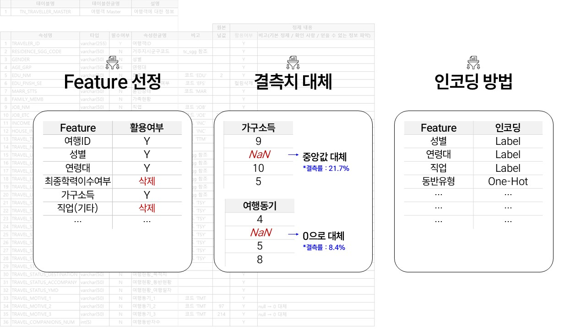
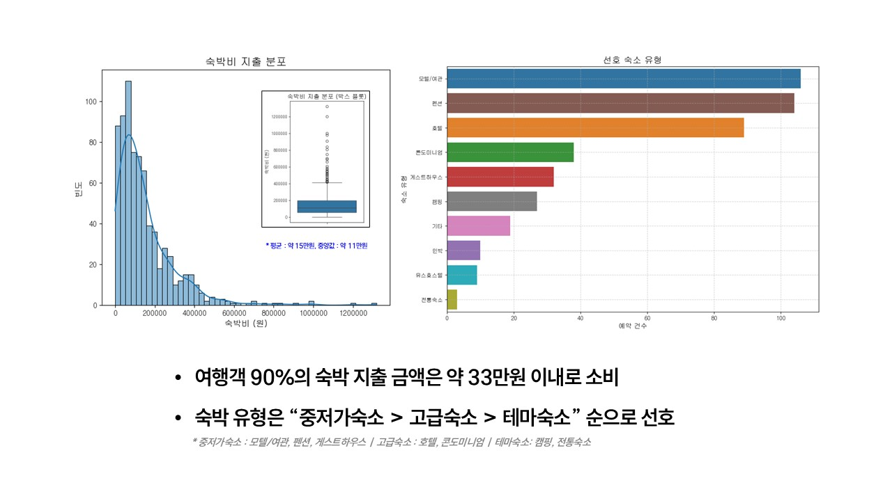
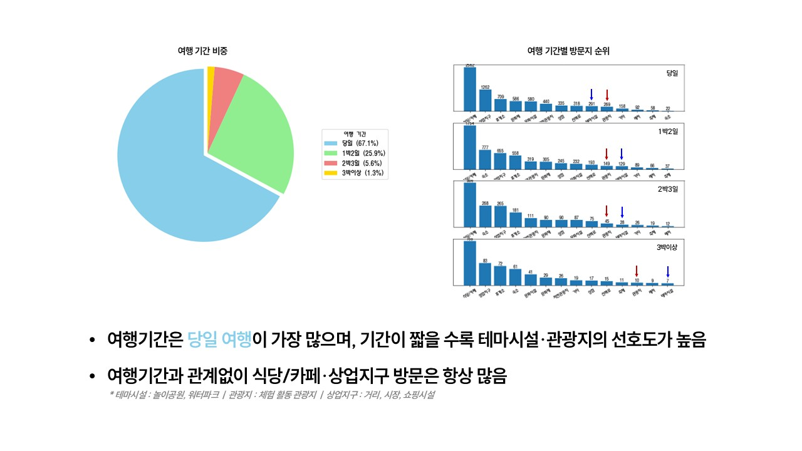
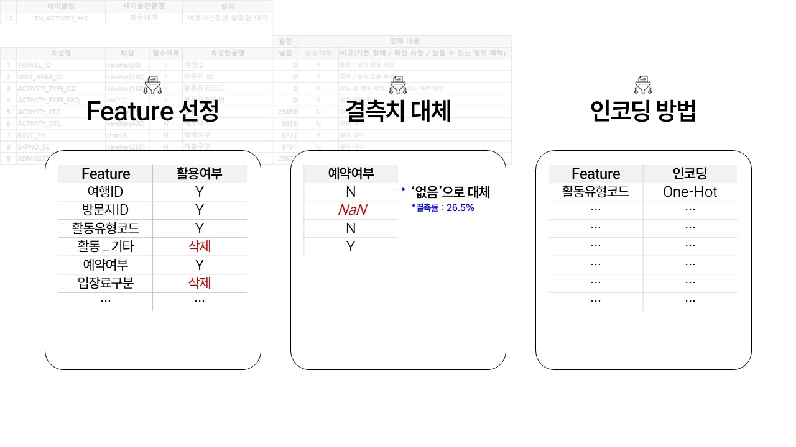

# 플랜B
- 팀원 소개 (이미지, 깃링크 준비!)
- 팀원1, 팀원2, 팀원3, 팀원4, 팀원5
 
  

## 주제: 휴가 붕괴 예보! 구름 많음… 혹은 꿀잼 확정?
## 1. 프로젝트 소개

## 2. 데이터 이해 (EDA)
- 데이터에 대한 전처리 과정을 포함해 주세요
### ✈️ 여행마스터테이블

### ✈️ 숙박소비내역테이블

### ✈️ 방문지정보테이블

### ✈️ 활동내역테이블

### ✈️ 활동소비내역테이블

## 3. 인사이트

## 4. ML 주제 선정
- 독립 변수 간의 여러 유의미한 관계를 시각화 해주세요.
- EDA를 통해 얻어진 인사이트를 작성해주세요.

## 5. 다음 작업 일정

## Apendix
- REPO명: 프로젝트명
- 프로젝트 폴더 구조

