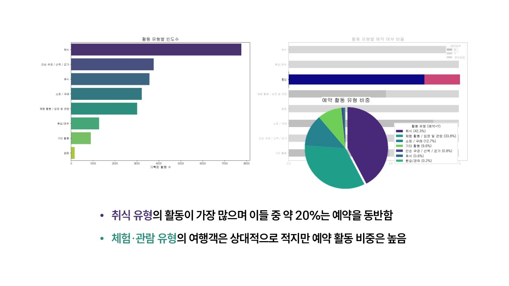
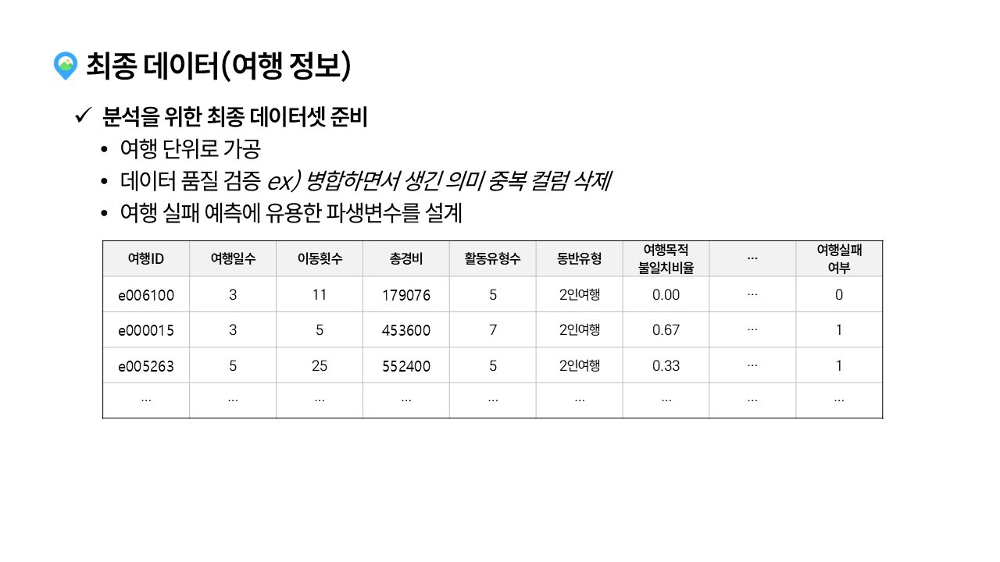

# 플랜B

안녕하세요! 플랜B팀의 프로젝트 과정을 담았습니다.

<table>
  <tr>
    <td align="center">
      <strong>강지완</strong><br><br>
      <br>
      <a href="https://github.com/Maroco0109">
        
      </a>
    </td>
    <td align="center">
      <strong>김성욱</strong><br><br>
      <br>
      <a href="https://github.com/souluk319">
        
      </a>
    </td>
    <td align="center">
      <strong>김소희</strong><br><br>
      <br>
      <a href="https://github.com/sosodoit">
        
      </a>
    </td>
    <td align="center">
      <strong>박진형</strong><br><br>
      <br>
      <a href="https://github.com/vispi94">
        
      </a>
    </td>
    <td align="center">
      <strong>이상민</strong><br><br>
      <br>
      <a href="https://github.com/ChocolateStrawberryYumYum">
        
      </a>
    </td>
  </tr>
</table>

## 📂 필수 산출물

| 테이블 | 데이터(폴더) | ipynb |
| ----- | ----- | ----- |
| 통합데이터 | [통합데이터](https://github.com/SKNetworks-AI19-250818/SKN19-mini-1Team/tree/develop/integrated_data/prep_data) | [전처리](https://github.com/SKNetworks-AI19-250818/SKN19-mini-1Team/tree/develop/integrated_data/prep_notebook) |
| 여행마스터 | [여행마스터](https://github.com/SKNetworks-AI19-250818/SKN19-mini-1Team/blob/develop/integrated_data/prep_data/traveller_master.csv) | [전처리](https://github.com/SKNetworks-AI19-250818/SKN19-mini-1Team/blob/develop/integrated_data/prep_notebook/%EC%97%AC%ED%96%89%EA%B0%9D%EB%8D%B0%EC%9D%B4%ED%84%B0%EC%A0%84%EC%B2%98%EB%A6%AC.ipynb) |
| 숙박소비내역 | [숙박소비내역](https://github.com/SKNetworks-AI19-250818/SKN19-mini-1Team/blob/develop/integrated_data/prep_data/lodging_consumption.csv) | [전처리](https://github.com/SKNetworks-AI19-250818/SKN19-mini-1Team/blob/develop/integrated_data/prep_notebook/%EC%88%99%EB%B0%95%EC%86%8C%EB%B9%84%EB%82%B4%EC%97%AD_%EC%A0%84%EC%B2%98%EB%A6%AC.ipynb) |
| 방문지정보 | [방문지정보](https://github.com/SKNetworks-AI19-250818/SKN19-mini-1Team/blob/develop/integrated_data/prep_data/visit_area_base.csv) | [전처리](https://github.com/SKNetworks-AI19-250818/SKN19-mini-1Team/blob/develop/integrated_data/prep_notebook/%EC%97%AC%ED%96%89%EB%B0%A9%EB%AC%B8%EC%A7%80%EB%82%B4%EC%97%AD_%EC%A0%84%EC%B2%98%EB%A6%AC.ipynb) |
| 활동내역 | [활동내역](https://github.com/SKNetworks-AI19-250818/SKN19-mini-1Team/blob/develop/integrated_data/prep_data/activity_history.csv) | [전처리](https://github.com/SKNetworks-AI19-250818/SKN19-mini-1Team/blob/develop/integrated_data/prep_notebook/%ED%99%9C%EB%8F%99%EB%82%B4%EC%97%AD_%EC%A0%84%EC%B2%98%EB%A6%AC.ipynb) |
| 활동소비내역 | [활동소비내역](https://github.com/SKNetworks-AI19-250818/SKN19-mini-1Team/blob/develop/integrated_data/prep_data/activity_consumption.csv) | [전처리](https://github.com/SKNetworks-AI19-250818/SKN19-mini-1Team/blob/develop/integrated_data/prep_notebook/%ED%99%9C%EB%8F%99%EC%86%8C%EB%B9%84%EB%82%B4%EC%97%AD_%EC%A0%84%EC%B2%98%EB%A6%AC.ipynb) |

## 📂 프로젝트 구조

```
  SKN19-mini-1Team/
  ├── data/
  │ ├── tag_code/
  │ │ ├── training/
  │ │ └── validation/
  │ ├── training/
  │ │ ├── TL_csv/
  │ │ ├── final/
  │ │ └── preprocessing/
  │ └── validation/
  │   └── VL_csv/
  ├──integrated_data
  │ ├── prep_data/
  │ │ ├── activity_cosumption.csv
  │ │ ├── activity_history.csv
  │ │ ├── lodging_cosumption.csv
  │ │ ├── traveller_master.csv
  │ │ └── visit_area_base.csv
  │ ├── prep_notebook/
  │ │ ├── 숙박소비내역_전처리.ipynb
  │ │ ├── 여행객데이터전처리.ipynb
  │ │ ├── 여행방문지내역_EDA.ipynb
  │ │ ├── 여행방문지내역_전처리.ipynb
  │ │ ├── 활동내역_전처리.ipynb
  │ │ ├── 활동소비내역_CD_전처리.ipynb
  │ │ └── 활동소비내역_전처리.ipynb
  ├── assets/
  │ └──img/
  ├── ppt/
  │ ├── 발표자료.pptx
  │ └── 슬라이드\*.JPG
  ├──  preprocessing/
  │ ├── merge_datasets.py
  │ ├── preprocessing.py
  │ ├── data/
  │ ├── img/
  │ └── notebook/
  ├── README.md
  └── requirements.txt
```

## 🔧 기술 스택

| 분류 | 사용 도구 |
| ----- | ----- |
| 언어 및 환경 |  |
| 데이터 전처리 |   |
| 시각화 |   |
| 협업 |     |

---
---

<br/>

## One Trip, Two Fates 👎👍


## 🔎 데이터 이해 (EDA)

### ✈️ 여행마스터테이블


### ✈️ 숙박소비내역테이블


### ✈️ 방문지정보테이블


### ✈️ 활동내역테이블




### ✈️ 활동소비내역테이블


## 💡 인사이트 요약 
- 여행객의 데모그라피에 따라 여행 규모(연령·동반인원·기간·예상등)가 뚜렷하다.
- 일반 숙소 비중이 크지만 이색 숙소도 분포해 "숙박 자체가 목적이 아닌 체험형 수요가 보인다.
- 여행객 특성(동반유형·이동횟수·총경비등)이 방문지 선호와 여행 만족도에 어떤 영향을 주는지 확인할 분석 가치가 있다.
- 활동 유형 조합과 지출·예약 패턴을 분석하여 여행테마·소비성향을 분류함으로써, 
- 출발 전 재미로 눌러보는 
"예측 확인 게임(Like 오늘의 운세는?)"에 반영해 "여행이 망할 확률"을 가볍게 보여주며 간단한 주의 포인트를 함께 제시해주는데 활용해보고자 한다.

## 📖 통합 데이터 개요 · EDA 





## 💪 NEXT ACTION


---
---

<br/>

### 📑 프로젝트 히스토리

<details>
<summary>브랜딩도 결과의 일부! 포스터·팀 캐릭터로 메시지 명확화</summary>

- 만든이의 한마디 `by 김성욱`

---

- 포스터가 저희의 프로젝트 메세지의 전달력을 높이는 '키'가 되었다고 생각합니다. 덕분에 팀 정체성이 강화되었습니다. `by 플랜B`

</details>

<details>
<summary>슬랙으로 아이디어는 자유롭게, 진행상황은 즉시 파악</summary>

- 처음 사용해보는 프로그램임에도 모든 팀원들이 적극적으로 활용하여서 뿌듯했습니다. 단순히 git 알람이 온다는 기능만 보고 시작하였는데 프로젝트 개요, 추척기 등을 사용하여 프로젝트 진행 상황을 기록하고 시각화하기 매우 편리했습니다. `by 강지완`

---

- 깃 연동이 되어서 커밋/PR 활동이 자동 알림되어 실시간으로 업무와 그 흐름을 즉각적으로 파악 할 수 있었습니다. `by 플랜B`
</details>

<details>
<summary>브랜치 전략으로 협업 안정화</summary>

- features/작업명-이름 → develop → main
- 개인 브랜치에서 작업하고 통합은 develop에서 검증 후 main에 반영하는 체계로 운용했습니다. `by 플랜B`

</details>

### 💬 한줄회고

<table style="width:100%, table-layout: fixed;">
  <tr>
    <th style="min-width: 100px;">이름</th>
    <th>회고 내용</th>
  </tr>
  <tr>
    <td style="width: 10%" align="center">강지완</td>
    <td>이번 EDA 과정을 진행하면서 협업이 무엇인지에 대해 다시 생각하게 되었습니다. 각자 맡은 일을 하는 분업은 일의 효율이 좋을 수 있지만, 공통된 문제에 대해 다같이 생각해보는 협업은 다양한 시각에서의 접근을 가능하게 해주었습니다. 단순한 문제 해결을 위한 과정보다 각자의 생각을 듣고 말하며 문제에 대한 이해도를 높일 수 있는 기회가 되었습니다.</td>
  </tr>
  <tr>
    <td style="width: 10%" align="center">김성욱</td>
    <td>이번 EDA 과정을 통해 수업 내용에 대한 이해도가 부족하다는 사실을 다시 새기게 되었고, 동시에 팀원들의 협력과 배려 덕분에 한층 성장할 수 있는 계기가 되었습니다. 다양한 시각에서 의견을 나누며 데이터를 바라보니 문제에 대한 이해가 훨씬 깊어졌습니다. 또한 주제 선정과 데이터 탐색에 충분한 시간을 들이는 것이 얼마나 중요한지도 깨닫게 되었습니다. 협업 도구를 활용해 실시간으로 소통하며 프로젝트를 진행한 경험 역시 매우 유익했으며, 앞으로 더 깊이 탐구할 수 있는 계기가 될 것 같습니다.</td>
  </tr>
  <tr>
    <td style="width: 10%" align="center">김소희</td>
    <td>데이터 탐색과 주제 선정에 시간을 충분히 투자한 덕분에 단순 분석에 그치지 않고 가치 있는 인사이트로 이어졌습니다. 프로젝트의 방향을 잡는 과정이 얼마나 중요한지 깨닫고 데이터를 깊이 들여다보는 것이 가치 있음을 배웠으며, 다음에도 더욱 깊이 탐색해보고자 합니다.</td>
  </tr>
  <tr>
    <td style="width: 10%" align="center">박진형</td>
    <td>프로젝트 초기엔 주요 포인트를 세일즈로 잡고 의견을 냈었는데, 다른 팀원분들과 소통하며 기술적으로 필요한 부분에 대해 이야기를 나누며 시야가 넓어질 수 있었습니다. 데이터를 처리하며 무엇을 신경써야 할 지 혼자 생각하기보다 여러 의견을 수렴하고 판단하는 방식이 중요함을 깨닫는 경험이 되었습니다.</td>
  </tr>
  <tr>
    <td style="width: 10%" align="center">이상민</td>
    <td>이번 미니 프로젝트를 시작하며 정한 주제는 1차 프로젝트 때에 비해서 데이터의 양이 훨씬 많아 더 좋은 결과가 나올 것 같아서 기대되었습니다. 컬럼들을 정리하는데 많은 노력이 들긴 했지만, EDA 과정에 대해서 학습하기에는 정말 좋은 경험이었던 것 같습니다. 또한 지완님의 추천으로 slack이라는 클라우드 컴퓨팅 기반 협업툴을 사용해보았는데, 실시간으로 협업을 진행하는데에 있어 많은 도움이 된 것 같습니다.</td>
  </tr>
</table>
