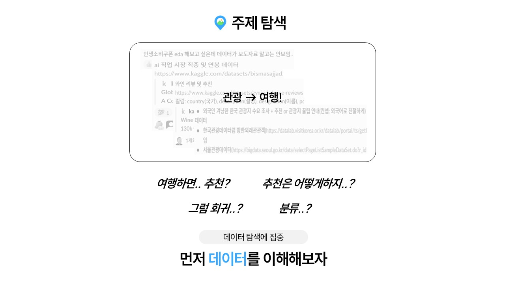
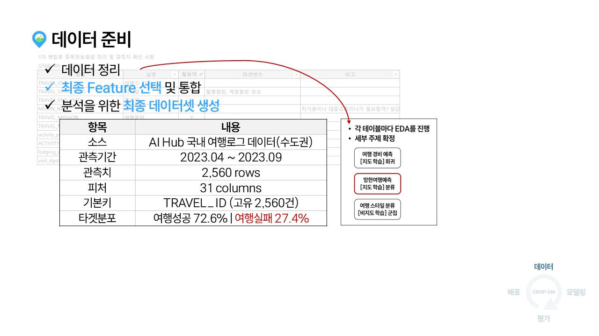

# 팀명 머더라...?

## 팀 소개

<table>
  <tr>
    <td align="center">
      <strong>강지완</strong><br><br>
      <br>
      <a href="https://github.com/Maroco0109">
        
      </a>
    </td>
    <td align="center">
      <strong>김성욱</strong><br><br>
      <br>
      <a href="https://github.com/souluk319">
        
      </a>
    </td>
    <td align="center">
      <strong>김소희</strong><br><br>
      <br>
      <a href="https://github.com/sosodoit">
        
      </a>
    </td>
    <td align="center">
      <strong>박진형</strong><br><br>
      <br>
      <a href="https://github.com/vispi94">
        
      </a>
    </td>
    <td align="center">
      <strong>이상민</strong><br><br>
      <br>
      <a href="https://github.com/ChocolateStrawberryYumYum">
        
      </a>
    </td>
  </tr>
</table>

## 주제: 휴가 붕괴 예보! 구름 많음… 혹은 꿀잼 확정?

## 1. 프로젝트 소개


## 2. 데이터 이해 (EDA)

- 데이터에 대한 전처리 과정을 포함해 주세요

### ✈️ 여행마스터테이블




### ✈️ 숙박소비내역테이블




### ✈️ 방문지정보테이블


### ✈️ 활동내역테이블


### ✈️ 활동소비내역테이블


## 3. 인사이트


## 4. 통합데이터전처리/시각화

### 데이터 스냅샷

| 항목      | 내용                                        |
| --------- | ------------------------------------------- |
| 소스      | `data/training/final/travel_insight_v1.csv` |
| 관측치    | 2,560 rows                                  |
| 피처      | 31 columns                                  |
| 기본 키   | `TRAVEL_ID` (고유 2,560건)                  |
| 타깃 분포 | 성공 72.6% (1,859건), 실패 27.4% (701건)    |


### 5. 산출물정리 (ppt 15page 리스트 참고 / '필수' 산출물 먼저 정리하기)

|담당자별| 전처리노트북명 | 깃링크 | 데이터셋 | 깃링크 |
|통합데이터|전처리노트북명|데이터셋|깃링크|


- 프로젝트 구조

```
  SKN19-mini-1Team/
  ├── data/
  │ ├── tag_code/
  │ │ ├── training/
  │ │ └── validation/
  │ ├── training/
  │ │ ├── TL_csv/
  │ │ ├── final/
  │ │ └── preprocessing/
  │ └── validation/
  │   └── VL_csv/
  ├── assets/
  │ ├── img/
  ├── ppt/
  │ ├── 발표자료.pptx
  │ └── 슬라이드\*.JPG
  ├──  preprocessing/
  │ ├── merge_datasets.py
  │ ├── preprocessing.py
  │ ├── data/
  │ ├── img/
  │ └── notebook/
  ├── README.md
  └── requirements.txt
```

- 기술스택

  | 분류          | 사용 도구                                                                                                                                                                                                                                                                                                                                                                                                                        |
  | ------------- | -------------------------------------------------------------------------------------------------------------------------------------------------------------------------------------------------------------------------------------------------------------------------------------------------------------------------------------------------------------------------------------------------------------------------------- |
  | 언어 및 환경  |                                                                                                                                                                                                                                                                                                                            |
  | 데이터 전처리 |                                                                                                                                                                                                             |
  | 시각화        |                                                                                                                                                                                                  |
  | 협업          |     |

- 산출물 표로 정리하고 링크 표시(상단 이미지로 redirect)

## 6. 다음 작업 일정


## Apendix

- 추신 : 본인 eda 페이지 수정 완전 가능하고 이건 꼭말하고싶다는거 추가자유
- 추신 : 위 할일 외에 추가시 추가된 부분 표시해주기 (박스삽입 등)
