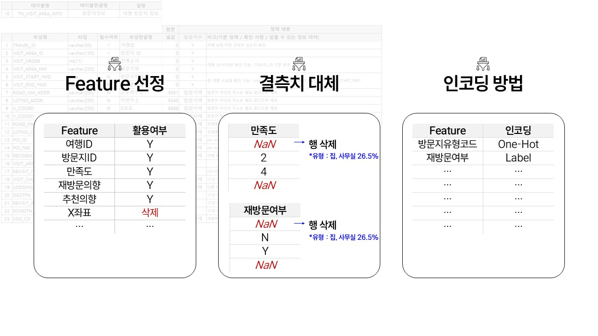

# 플랜B - 여행 실패 예측 프로젝트

## 팀 소개

| 멤버   | 담당 영역                                                                                               | GitHub                                                        |
| ------ | ------------------------------------------------------------------------------------------------------- | ------------------------------------------------------------- |
| 강지완 | 통합 데이터셋 구축, ERD 검토 및 전처리 파이프라인                                                       | [@JiwanKang](https://github.com/Maroco0109)                   |
| 김성욱 | 데이터(여행객 활동 내역) 전처리 및 README 작성 (팀 소개 및 프로젝트 개요)                               | [@souluk319](https://github.com/souluk319)                    |
| 김소희 | 데이터(방문지 정보) 전처리, ERD 설계, 인사이트 정리 및 README 작성 (전체 파이프라인 및 발표용 슬라이드) | [@sosodoit](https://github.com/sosodoit)                      |
| 박진형 | 데이터(활동 소비 내역) 전처리 및 통합 데이터셋 정리                                                     | [@vispi94](https://github.com/vispi94)                        |
| 이상민 | 데이터(여행객 마스터 테이블) 전처리, README 검토 및 발표                                                | [@jjoggoddalgi](https://github.com/ChocolateStrawberryYumYum) |

> 팀 프로필 이미지 필요 시 삽입 가능

## 프로젝트 개요

- **목표**: 다양한 여행 로그를 기반으로 여행 실패(만족도 저하) 가능성을 예측하는 이진 분류 모델 수립.
- **활용 시나리오**: 여행 전 "예측 확인 게임"으로 리포트를 제공해 일정 조정 및 소비 계획 가이드를 제안.
- **데이터 규모**: 여행 ID 기준 약 2,560건, 타깃은 `travel_fail = 1`.
- **데이터셋**: 여행마스터, 숙박소비, 방문지정보, 활동내역, 활동소비 등 5개 테이블.

## 데이터 이해 & 전처리 전략

여행 관련 5개 테이블에 대해 결측·이상치 점검, 타입 정리, 특성 관계 분석 및 파생 변수 구성을 수행했습니다.

### 여행자 기본 정보 & 동반 유형

- 20~30대의 소규모 여행 비중이 가장 높으며, 30~40대는 가족·단체 여행이 잦음.
- 동반 유형 분포를 기반으로 `TRAVEL_COMPANIONS_NUM` 정규화 및 1인 여행 지표 생성 예정.

### 숙박 소비 테이블

- 결제일시는 여행 시작일로 대체, 도로명 주소 결측은 "정보없음"으로 통일.
- 숙박유형코드 및 결제방식구분을 원-핫/라벨 인코딩하여 모델 입력으로 활용.

### 활동 정보 & 소비

- 결측 소비 내역은 "없음" 카테고리로 보강, 활동유형코드는 One-Hot 인코딩.
- 취식 활동이 전체의 66%를 차지하며, 결제금액·소비인원은 극단치가 존재 → 로그 변환 또는 윈저라이징 고려.

## EDA 인사이트 요약

- 동반 유형, 숙소 유형, 이동 횟수가 전반적 만족도와 연관됨.
- 방문지 만족·재방문·추천 점수를 활용해 **방문지 단위 실패(bad_spot)** 및 **여행 단위 실패**를 정의.
- 망한 방문지가 전체 방문의 50% 이상이면 여행 실패(타깃=1)로 라벨링.

## 통합 데이터 전처리 & 시각화

- 결측치/이상치는 병합 후 재확인하여 중복 컬럼 제거 (`MVMN_NM` 등 정보 미보유 컬럼 제거 완료).
- `TRAVEL_START_YMD`에서 월·계절 파생 컬럼 생성, `travel_mission` 대비 실제 활동 여부 파생 변수 진행 중.
- 최종 파생 지표는 seaborn 기반 시각화로 타깃과의 관계 분석 예정.

## 진행 일정

### - 머신러닝 데이터 준비

| 작업                                           | 상태 | 담당자         | 검토자         | 시작 | 마감 | 산출물        |
| ---------------------------------------------- | ---- | -------------- | -------------- | ---- | ---- | ------------- |
| 통합 데이터셋 병합                             | 완료 | 강지완         | 김소희         | 9/23 | 9/24 | 통합 데이터셋 |
| 데이터 정제 (결측치/이상치 처리)               | 완료 | 김성욱, 박진형 | 강지완, 이상민 | 9/23 | 9/24 |               |
| 피처 엔지니어링 (파생 변수 생성)               | 예정 | 강지완, 이상민 | 김소희         | 9/23 | 9/24 |               |
| 데이터 품질 검증 (이상값, 중복값, 스케일 확인) | 예정 | 김소희         | 강지완         | 9/23 | 9/24 |               |
| 데이터셋 분할 (Train/Validation/Train)         | 예정 | 김성욱, 박진형 | 김소희         | 9/23 | 9/24 |               |

### - 머신러닝 모델링

| 작업                | 상태 | 담당자         | 검토자         | 시작 | 마감 | 산출물             |
| ------------------- | ---- | -------------- | -------------- | ---- | ---- | ------------------ |
| 모델 후보 선정      | 예정 | ALL            | ALL            | 9/23 | 9/26 |                    |
| 베이스라인 설계     | 예정 | 강지완, 이상민 | 김소희         | 9/23 | 9/26 |                    |
| 하이퍼파라미터 튜닝 | 예정 | 김성욱, 박진형 | 강지완, 이상민 | 9/23 | 9/26 |                    |
| 성능 평가           | 예정 | 김성욱, 박진형 | 강지완, 이상민 | 9/23 | 9/26 | 성능 평가 비교 표  |
| 중요 변수 분석      | 예정 | 강지완         | 김소희         | 9/23 | 9/26 | 변수 중요도 시각화 |
| 최종 결과 정리      | 예정 | 김소희         | 강지완         | 9/23 | 9/26 |                    |

## 산출물 & 자료 링크

- `preprocessing/` 폴더: 전처리 스크립트 및 `file_dir.json` 매핑 파일.
- `data/training/preprocessing/`: 통합 CSV (`final_traveler.csv`)와 샘플 추출본.
- 노트북 & 리포트: 담당자별 전처리/EDA 노트북, 통합 데이터 노트북, 최종 보고서 (링크는 추후 표로 정리).
- 기술 스택(표), 프로젝트 폴더 구조, ERD 는 후순위 작업으로 TODO 표기.

## 다음 업데이트 체크리스트

- 팀원별 프로필 이미지 및 상세 역할 입력.
- 산출물 표에 노트북/데이터셋 경로, GitHub 링크 삽입.
- 모델링 결과 및 성능 지표 추가, README 최종 반영 전 컬러·폰트 컨셉 확정.
