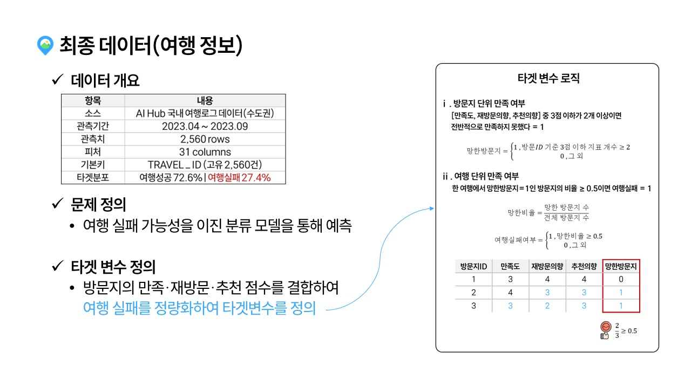
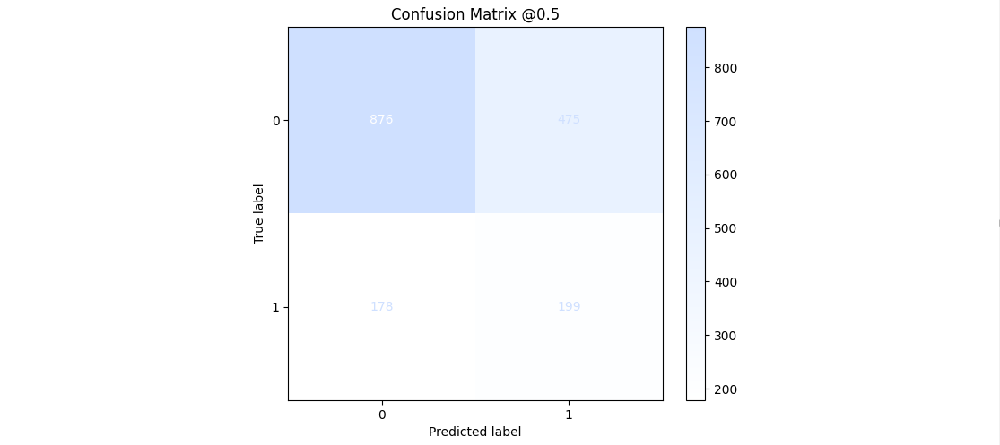
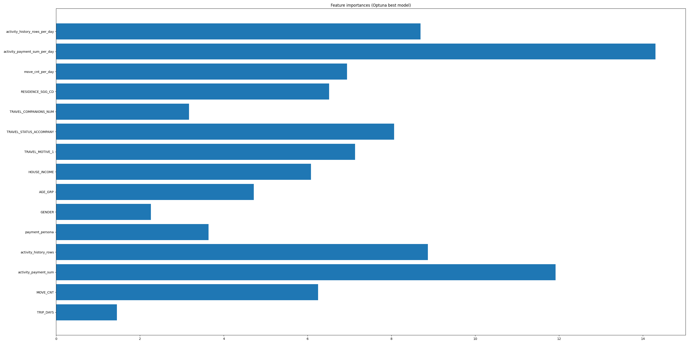
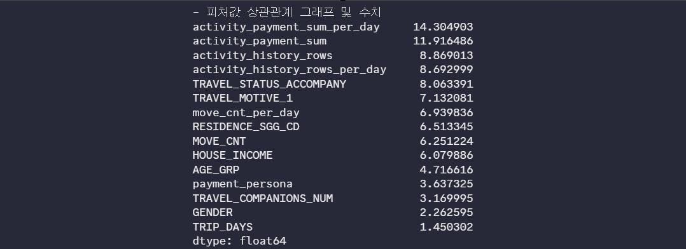

# 플랜B

안녕하세요! 플랜B팀의 프로젝트 과정을 담았습니다.

<table>
  <tr>
    <td align="center">
      <strong>강지완</strong><br><br>
      <br>
      <a href="https://github.com/Maroco0109">
        
      </a>
    </td>
    <td align="center">
      <strong>김성욱</strong><br><br>
      <br>
      <a href="https://github.com/souluk319">
        
      </a>
    </td>
    <td align="center">
      <strong>김소희</strong><br><br>
      <br>
      <a href="https://github.com/sosodoit">
        
      </a>
    </td>
    <td align="center">
      <strong>박진형</strong><br><br>
      <br>
      <a href="https://github.com/vispi94">
        
      </a>
    </td>
    <td align="center">
      <strong>이상민</strong><br><br>
      <br>
      <a href="https://github.com/ChocolateStrawberryYumYum">
        
      </a>
    </td>
  </tr>
</table>

# 📂 필수 산출물

(여기에 산출물 추가)

| 테이블       | 데이터(폴더)                                                                                                                               | ipynb                                                                                                                                                                                                             |
| ------------ | ------------------------------------------------------------------------------------------------------------------------------------------ | ----------------------------------------------------------------------------------------------------------------------------------------------------------------------------------------------------------------- |
| 통합데이터   | [통합데이터](https://github.com/SKNetworks-AI19-250818/SKN19-mini-1Team/tree/develop/integrated_data/prep_data)                            | [전처리](https://github.com/SKNetworks-AI19-250818/SKN19-mini-1Team/tree/develop/integrated_data/prep_notebook)                                                                                                   |
| 여행마스터   | [여행마스터](https://github.com/SKNetworks-AI19-250818/SKN19-mini-1Team/blob/develop/integrated_data/prep_data/traveller_master.csv)       | [전처리](https://github.com/SKNetworks-AI19-250818/SKN19-mini-1Team/blob/develop/integrated_data/prep_notebook/%EC%97%AC%ED%96%89%EA%B0%9D%EB%8D%B0%EC%9D%B4%ED%84%B0%EC%A0%84%EC%B2%98%EB%A6%AC.ipynb)           |
| 숙박소비내역 | [숙박소비내역](https://github.com/SKNetworks-AI19-250818/SKN19-mini-1Team/blob/develop/integrated_data/prep_data/lodging_consumption.csv)  | [전처리](https://github.com/SKNetworks-AI19-250818/SKN19-mini-1Team/blob/develop/integrated_data/prep_notebook/%EC%88%99%EB%B0%95%EC%86%8C%EB%B9%84%EB%82%B4%EC%97%AD_%EC%A0%84%EC%B2%98%EB%A6%AC.ipynb)          |
| 방문지정보   | [방문지정보](https://github.com/SKNetworks-AI19-250818/SKN19-mini-1Team/blob/develop/integrated_data/prep_data/visit_area_base.csv)        | [전처리](https://github.com/SKNetworks-AI19-250818/SKN19-mini-1Team/blob/develop/integrated_data/prep_notebook/%EC%97%AC%ED%96%89%EB%B0%A9%EB%AC%B8%EC%A7%80%EB%82%B4%EC%97%AD_%EC%A0%84%EC%B2%98%EB%A6%AC.ipynb) |
| 활동내역     | [활동내역](https://github.com/SKNetworks-AI19-250818/SKN19-mini-1Team/blob/develop/integrated_data/prep_data/activity_history.csv)         | [전처리](https://github.com/SKNetworks-AI19-250818/SKN19-mini-1Team/blob/develop/integrated_data/prep_notebook/%ED%99%9C%EB%8F%99%EB%82%B4%EC%97%AD_%EC%A0%84%EC%B2%98%EB%A6%AC.ipynb)                            |
| 활동소비내역 | [활동소비내역](https://github.com/SKNetworks-AI19-250818/SKN19-mini-1Team/blob/develop/integrated_data/prep_data/activity_consumption.csv) | [전처리](https://github.com/SKNetworks-AI19-250818/SKN19-mini-1Team/blob/develop/integrated_data/prep_notebook/%ED%99%9C%EB%8F%99%EC%86%8C%EB%B9%84%EB%82%B4%EC%97%AD_%EC%A0%84%EC%B2%98%EB%A6%AC.ipynb)          |

# 📂 프로젝트 구조

```

  SKN19-mini-1Team/
  ├── data/
  │ ├── tag_code/
  │ │ ├── training/
  │ │ └── validation/
  │ ├── training/
  │ │ ├── TL_csv/
  │ │ ├── final/
  │ │ └── preprocessing/
  │ └── validation/
  │   └── final/
  ├── ML/
  │ ├── outputs/
  │ ├──00_ML_EDA.ipynb
  │ ├──01_CatBoost.ipynb
  │ ├──01_clust_cat.ipynb
  │ ├──01_Clustering.ipynb
  │ ├──01_SVM.ipynb
  │ ├──01_XGBoost.ipynb
  │ ├──cols.py
  │ ├──columns.py
  │ ├──oof_probabilities_compare.csv
  │ ├──TN_traveler_catboost.csv
  │ ├──TN_traveler.csv
  │ ├──TP_traveler_catboost.csv
  │ ├──TP_traveler.csv
  ├── assets/
  │ └──img/
  │ │ └── *.png
  ├──  preprocessing/
  │ ├── merge_datasets.py
  │ ├── preprocessing.py
  │ ├── data/
  │ ├── img/
  │ └── notebook/
  ├── READNE_ML.md
  └── requirements.txt

```

# 🔧 기술 스택

| 분류              | 사용 도구 |
|-------------------|-----------|
| 언어 및 환경      |  |
| 머신러닝 / 모델링 |    |
| 시각화            |   |
| 협업              |     |


---

<br/>

# One Trip, Two Fates 👎👍

# 💡 리마인드




- 여행 실패 가능성을 이진 분류 모델을 통해 예측하고, 사용자에게 결과를 알려주는 시스템 생성
- EDA 과정을 거쳐 필요한 데이터를 정제, ML에 사용할 수 있도록 처리
- 도출한 인사이트를 이용해 어떤 방향으로 프로젝트를 진행할지 계획

<br/>

# ☀️ 최종 모델 & 성능

- 주요 포인트만 짚으면서 결과값이 잘 나온 파트 위주로 강조.
- 왜 이런 결과가 도출되었는지 자연스럽게 다음 파트로 진행.





<br/>

# 📕 모델 선정 & 성능 향상 과정

- 가장 강조되야할 파트이므로 선정 이유와 성능 향상 과정을 디테일하게 설명.
- 비교 내용이 명확히 보이거나, 유의미한 내용은 강조 표시.

<br/>

## ✨ 시연

- 1차 프로젝트 처럼 길게 보여지진 않을 예정이니, 가벼운 언사와 함께 발표하면 좋을 듯함.

## 🔫 트러블 슈팅팅

<details>
<summary>1) 타깃 레이블 문제</summary>
<br/>

**문제 요약**
- 만족도/추천도/재방문을 단일 컬럼으로 레이블링 → 노이즈·무작위성↑
- 경험 다양성(활동량/스타일) 미반영 → 일반화 약함
- 설문형 지표 기반 평균치 쏠림 → 클래스 불균형

**해결 방향**
- 레이블 재정의: 이항/다항 기준 명확화(예: 상·중·하, 또는 NPS Cutoff)
- 다중 지표 합성: (만족도·추천·재방문) 가중 평균/규칙 기반 스코어
- 클래스 불균형 보정: Stratified split, class_weight/SMOTE, 임곗값 튜닝
- 타깃 누수 점검: 설문 문항 중 결과에 직결되는 항목 제외
</details>

<br/>

<details>
<summary>2) 모델 점프 & 범주형 처리</summary>
<br/>

**문제 요약**
- 범주형 변수 다수·고카디널리티(여행 목적/활동/페르소나 등)
- 원-핫 인코딩 난해한 수준의 다양성 → 범주형에 강한 알고리즘 선호

**해결 방향**
- CatBoost/LightGBM(categorical) 우선: 자동 카테고리 처리 활용
- 고카디널리티 인코딩: 타깃 인코딩/빈도 인코딩/Hashing 조합
- 피처 정리: 희소·희귀 카테고리 묶기(“기타”), 누락값 일관 정책
- 데이터 누적: 최근/빈도 기반 이력 피처(활동 수·주기·신규/재방문 플래그)

</details>

<br/>

<details>
<summary>3) 최적화 & 일반화</summary>

<br/>

**문제 요약**
- Train↑ / Test↓ 패턴 반복 → 과적합 의심
- 양성(성공) 희소 → PR-AUC 지표 적합
- 교차검증은 Stratified K-Fold 권장
- Optuna로 핵심 파라미터(depth, iterations, lr, l2_leaf_reg, min_data_in_leaf 등) 탐색

**해결 방향**
- 규제·단순화: l2 강화, depth 축소, min_data_in_leaf↑, feature pruning
- 조기 종료/학습률: early_stopping_rounds, lr 스케줄
- 평가 체계: PR-AUC + 임곗값 최적화(F1/Youden/J-Index 등)
- 리샘플링: class_weight/언더·오버샘플링, K-Fold 일관화

</details>


## 💬 한줄회고

(각자... 잘... 적어주십쇼...)

<table style="width:100%, table-layout: fixed;">

<tr>

<th style="min-width: 100px;">이름</th>

<th>회고 내용</th>

</tr>

<tr>

<td style="width: 10%" align="center">강지완</td>

<td></td>

</tr>

<tr>

<td style="width: 10%" align="center">김성욱</td>

<td></td>

</tr>

<tr>

<td style="width: 10%" align="center">김소희</td>

<td></td>

</tr>

<tr>

<td style="width: 10%" align="center">박진형</td>

<td></td>

</tr>

<tr>

<td style="width: 10%" align="center">이상민</td>

<td></td>

</tr>

</table>
